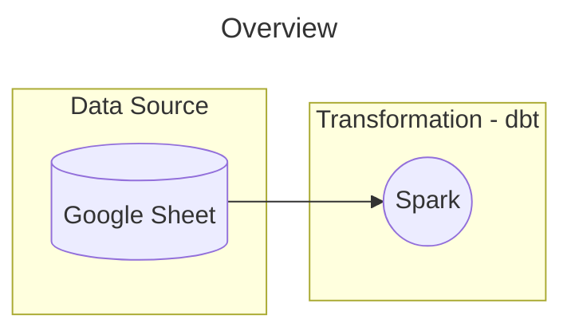

# Hibi

Hibi is a data project aimed at analyzing expense tracking data in Google Sheets. It extends beyond Google Sheets' standard reporting capabilities by applying AI to enhance spending pattern analysis, providing deeper insights into your financial data.



## Quick Start

### Prerequisites

- Python 3.12+
- Google Cloud Platform account
- Google Sheets API enabled
- OAuth 2.0 credentials

### Installation
```bash
git clone https://github.com/tuananh8497/hibi.git
cd hibi
pip install -r requirements.txt
```

### Usage

```bash
TODO
```

## Setup Credentials

1. Copy `env/client_secret.json.template` to `env/client_secret.json`
2. Fill in your Google OAuth credentials in the copied file
3. Never commit the actual credentials file to version control

## Features

- Track expenses via command line
- Sync with Google Sheets
- View expense summaries
- Multiple currency support
- Simple and fast data entry

## License

