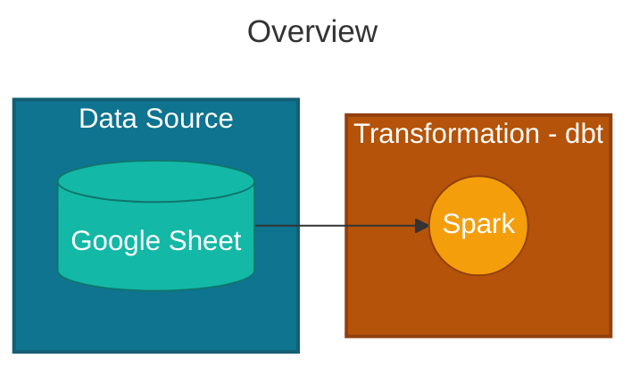

# Hibi

Hibi is a data project aimed at analyzing expense tracking data in Google Sheets. It extends beyond Google Sheets' standard reporting capabilities by applying AI to enhance spending pattern analysis, providing deeper insights into your financial data.

In this ingestion process, we use Python code to process data through Spark Connect to a local cluster, optimizing costs by avoiding cloud resources. This approach allows efficient data transformation while maintaining a cost-effective local development environment.



## Quick Start

### Prerequisites

- Python 3.12+
- JDK (Java 17+) 
- Google Cloud Platform account
- Google Sheets API enabled
- OAuth 2.0 credentials

### Installation
```bash
git clone https://github.com/tuananh8497/hibi.git
cd hibi

# With makefile
make setup

# without Makefile
pip install -r requirements.txt
```

#### Setup Spark-Cluster with Spark Connect
1) Install JDK (Java 17+)
```bash
brew install openjdk@17
echo 'export PATH="/opt/homebrew/opt/openjdk@17/bin:$PATH"' >> ~/.zshrc
echo 'export JAVA_HOME=$(/usr/libexec/java_home -v 17)' >> ~/.zshrc
exec zsh
java -version 
```

2) Unpack Spark and set SPARK_HOME 
```bash
mkdir -p ~/tools && cd ~/tools
tar -xvf ~/Downloads/spark-4.0.1-bin-hadoop3.tar
mv spark-4.0.1-bin-hadoop3 spark-4.0.1
echo 'export SPARK_HOME=$HOME/tools/spark-4.0.1' >> ~/.zshrc
echo 'export PATH=$SPARK_HOME/bin:$SPARK_HOME/sbin:$PATH' >> ~/.zshrc
exec zsh
```

3) Start Spark Connect Server
`$SPARK_HOME/sbin/start-connect-server.sh` or `make start-local-spark` 

3) Stop Spark Connect Server
`$SPARK_HOME/sbin/stop-connect-server.sh` or `make stop-local-spark`

### Usage

```bash
TODO
```

## Setup Credentials

1. Copy `env/client_secret.json.template` to `env/client_secret.json`
2. Fill in your Google OAuth credentials in the copied file
3. Never commit the actual credentials file to version control

## Features

- Track expenses via command line
- Sync with Google Sheets
- View expense summaries
- Multiple currency support
- Simple and fast data entry

## License

This project is licensed under the Apache License - see the [LICENSE](LICENSE) file for details.